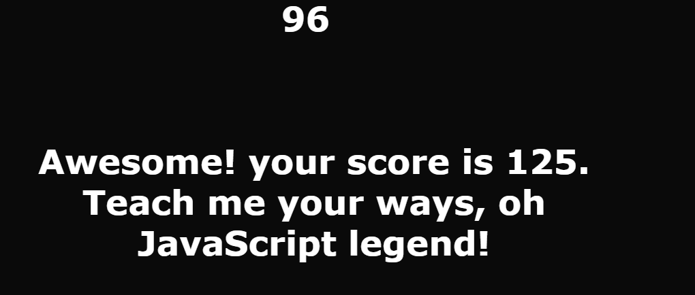

## User Story

```
AS A coding boot camp student
User will take a timed quiz on JavaScript fundamentals that stores high scores
User will be able to gauge their progress compared to their peers
```

## Acceptance Criteria

```
I am taking a code quiz
When I click the start button
Then a timer starts and I am presented with a question
When I answer a question
Then I am presented with another question
When I answer a question incorrectly
Then time is subtracted from the clock
When all questions are answered or the timer reaches 0
Then the game is over
When the game is over
Then I can save my initials and my score
```

## Mock-Up

Deployed application.




## Github Pages

https://papicly.github.io/Fun-Qiz/